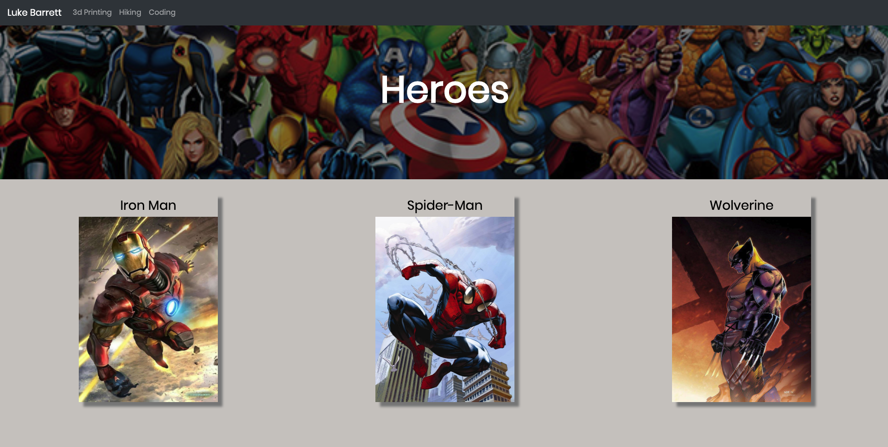

# html-practice

This is a basic html page I created to test some of my html and css skills.

The site includes some external links, images, html hero, flexbox, and some css hover transitions.

# Commands to get up and running

open terminal and make sure to navigate to the html-practice folder and run the following command.

```
open index.html
```

When opend it should look like the followingn image:



# Creator

Luke Barrett

# License

MIT
